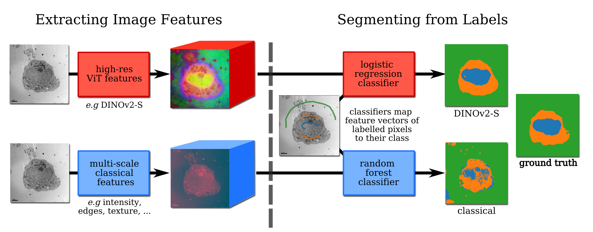
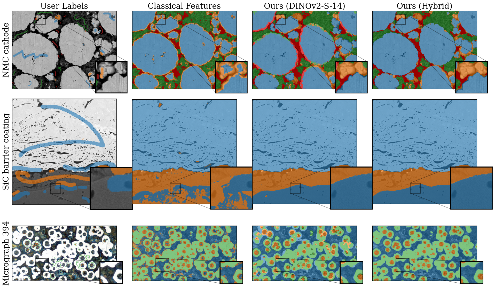

# High-Res DINOv2 (HR-Dv2)

Upsampling spatialised features from vision transformer (ViT) models like DINO and DINOv2 for unsupervised and weakly-supervised materials segmentation.

<p align="center">
    
</p>
Image: Shared PCA visualisations of the high(er)-resolution features.

See `minimum_example.ipynb` for usage.
GPU recommended - if running into memory errors try using 'forward_sequential' mode. 


## Weakly-supervised segmentation

The folder `app/` contains a very bare-bones weakly supervised segmentation app for testing your own data. Run (with .venv or conda env activated) from the root folder":
```
python app/main.py
```
Note the app resize longest side to 518 by default, so may take a while to compute features on low-end devices, or may downsample large images.

Tkinter theme from user [rdbende on github](https://github.com/rdbende/Azure-ttk-theme)

<p align="center">
    
</p>


<p align="center">
    
</p>


## Install:

Requires Python 3.10 or greater.


### Linux
```bash
cd HR-Dv2/
pip install -r install/requirements.txt
pip install -e .
```

To install with conda (recommended, gets pytorch sorted):
```bash
cd HR-Dv2/
conda env create -f install/conda.yaml
conda activate dinov2
pip install -e .
```

Then install the GUI theme:
```bash
git clone https://github.com/rdbende/Azure-ttk-theme
mkdir -p app/tk_themes
cp -a Azure-ttk-theme/theme/. app/gui_elements/tk_themes/theme
cp Azure-ttk-theme/azure.tcl app/gui_elements/azure.tcl
```

To compare with [FeatUp](https://github.com/mhamilton723/FeatUp), a different feature upsampler:
```bash
pip install git+https://github.com/mhamilton723/FeatUp
```


### Windows
Install Ananconda. In an 'Anaconda PowerShell Prompt' (search in start menu), run:

```powershell
cd ".\HR-Dv2\"
conda env create -f ".\install\conda.yaml"
conda activate dinov2
pip install -e .
# We might need to force-reinstall numpy scipy and matplotlib
conda install --force-reinstall "numpy<2" scipy matplotlib
# normally trition installed as part of dinov2 install on linux
pip install triton-windows

# download the app tkinter theme
git clone https://github.com/rdbende/Azure-ttk-theme
mkdir "app\tk_themes\"
Copy-Item -Path ".\Azure-ttk-theme\theme" -Destination "D:\app\gui_elements\tk_themes\theme" -Recurse
Copy-Item -Path ".\Azure-ttk-theme\azure.tcl" -Destination "D:\app\gui_elements\tk_themes\azure.tcl"
```