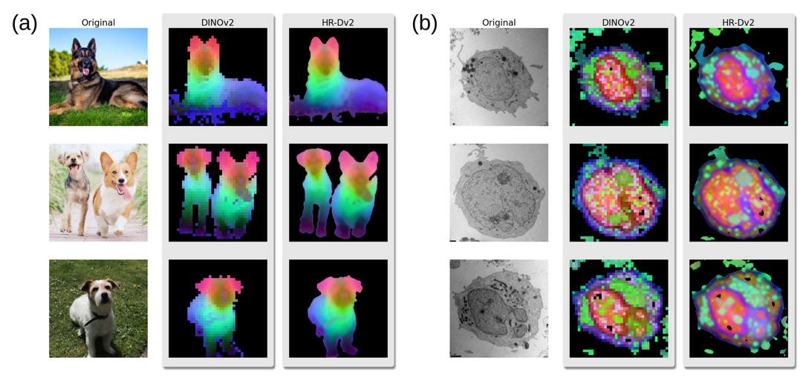

# High-Res DINOv2 (HR-Dv2)

    

### ViT Features:
`DINOv2` (Dv2) [[1]](#links) is student-teacher self-distillation model for self-supervised feature learning with a `ViT` [[2]](#links) backbone. The training DS was 1.2B images - they claim it's been trained on a wide enough corpus that fine-tuning is unnecessary and show good performance by training linear heads on top of the frozen backbone. It used a more complicated training procedure than other models, like `MAEs` [[3]](#links) but promises better performance. 

Accesible `DINOv2` checkpoints are trained with a patch size of $14 \times 14$ px, meaning the features produced are at that resolution (*i.e,* $h / 14 \times w / 14$). It can be trained from scratch (costly, long) with smaller patch sizes. They achieve good performance on pixel-level tasks like depth estimation and sematic segmentation by training a networks with conv2Dt upsampling on datasets with pixel-level annotations. Unfortunately, we don't have access to pixel level annotation datasets for most materials science or biological image processing problems, and would like to achieve high-resolution features without additional training or datasets.

### Prior Work:
Amir *et. al.* (VE) [[4]](#links) achieved high resolution features from `DINO` [[5]](#links) and other `ViTs` by adjusting the stride of the conv2D in the projection part of the embedding layer. Normally the stride $S$ is equal to the patch size $P$ for non-overlapping patches. By setting $S = P/2, P/4, ...$ and interpolating the positional encoding they can achieve higher resolution features. This works well but has a downside: more patches means more tokens in the transformer network, which scales with token number $n$ as $\mathcal{O}(n^2)$ because of the all-to-all nature of attention. Assuming a square image length $L$, the token number scales $n \propto L / S$. This gives us a **quartic** scaling for memory footprint and time in $S$ (and also $L$), so achieving pixel-level features for regular images can be tough.

They used these features for co-segmentation (segmenting common features of multiple realisations of a class) and point correspondence on CUBS [[6]](#links), PASCALVOC12 [[7]](#links) and other datasets using deliberately simple algorithms like k-means. From testing the framework with Dv2, there is sometimes high resolution/artefacting/noise, and for homogeneous micrographs there's a gradient across the image features. 

### Proposed Method:
I propose a different solution (HR-Dv2):

0) Input image $I$ with dimensions $(h, w)$ 
1) Pixel shift the image by $N < P / 2,\:N \in \mathbb{Z^+}$ pixels in the $N_{d}=4/8$ directions in a Von Neumann/Moore neighbourhood with periodic BCs 
2) Compute the (low-res) features for each shifted image with `DINOv2` with $S=P$
3) Resize each low-res map from $(h / P, w / P)$ to $(h, w)$ 
4) Unshift each image by moving it $N$ pixels in the opposite direction
5) Spatially average across all unshifted images to produce high-res $(h, w)$ feature map

This has the same complexity as `DINOv2` as the stride $S$ is the same, and can be done in one forward pass with batching. The memory footprint is dominated by the cost of full-res feature map. It scales better than VE, but has its own drawbacks - namely it can be over-smooth or have grid artefacting. The interesting thing is that **this approach is compatible with the VE approach** by using a VE enhanced Dv2 alongside the pixel shifts (within memory constraints) - we can achieve some crisp $2$ or $4\times$ upsampling with VE then use HR-Dv2 for further upsampling. Also, we aren't just limited to pixel shifts as transformations in steps 1 and 4, we can use any invertible transformation (rotation, flipping, *etc.*)

## Links
1) **DINOv2:** [[`Paper`](https://arxiv.org/abs/2304.07193)] [[`Code`](https://github.com/facebookresearch/dinov2/tree/main)]  [[`Project Page`](https://dinov2.metademolab.com/)]
2) **ViT:** [[`Paper`](https://arxiv.org/abs/2010.11929)] [[`Code`](https://github.com/google-research/vision_transformer)]
3) **MAE:** [[`Paper`](https://arxiv.org/abs/2111.06377)] [[`Code`](https://github.com/facebookresearch/mae)]
4) **ViT Feature Extractor:** [[`Paper`](https://arxiv.org/abs/2112.05814)] [[`Code`](https://github.com/ShirAmir/dino-vit-features)]  [[`Project Page`](https://dino-vit-features.github.io/index.html#sm)]
5) **DINO:** [[`Paper`](https://arxiv.org/abs/2104.14294)] [[`Code`](https://github.com/facebookresearch/dino)]
6) **CUBS:** [[`Dataset`](https://www.vision.caltech.edu/datasets/cub_200_2011/)]
7) **PASCALVOC12:** [[`Dataset`](http://host.robots.ox.ac.uk/pascal/VOC/voc2012/)]